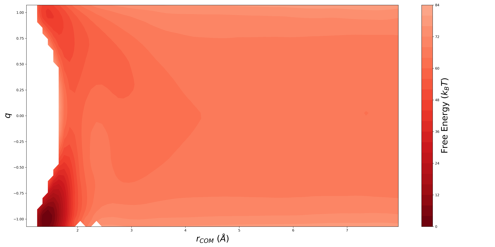

# Dock-Lock Molecular Dynamics code

This is the L repository for all the tools developed for [Multiscale Models for Fibril Formation: Rare Events Methods, Microkinetic Models, and Population Balances](https://www.mdpi.com/2075-1729/11/6/570).

* `BigBox`: Contains the C code for the Langevin integerator and the custom force-field as described in the original paper. 
`./cte_conc` is in constant concentration of peptides and `./no_replace` is for simulating the growth starting from a given number of peptides present.

* `NAM`: [Northrup-Allison-McCammon method](https://doi.org/10.1063/1.446900) for calcualting rate of encouter for two particles with Brownian dynamics.
`./short_chain` folder contains example calculations for various starting and cut-off distances with the original Langevin integrator and python scripts to submit parallel runs to a cluster and to extract final statistics. A Jupyter notebook of the analysis `NAM_Analysis.ipynb`, which essentially runs `beta_analysis.py` on all runs, is also provided.

* `Umbrella_sampling`: This directory contains the python and C scripts used for umbrella sampling and generating the free energy surface figure (`visualization/FES.png`).
`./run_files` containts the modified Langevin integrator with spring potentials implemeneted. This directory also contains `Umbrella.py` that creates the C files with the spring at different locations(`main_temp.c`), compiles it, and submits it to a cluster using `job.sh` file. `fix.py` creates the input file for `WHAM` using trajectory files generated by the runs. `Histogram_check.ipynb` plots the histogram for manual inspection of the histograms' overlap.
`./visualization` contains the scripts used to visualize the free energy surface created by WHAM. `1d_far.txt` is an example of a **processed** output file from WHAM and `FES.png` is the resulting figure. `WHAMpmf_process.py` preprocesses the `.pmf` output of WHAM and `plotdata.py` plots the preprocessed `.txt` file.

